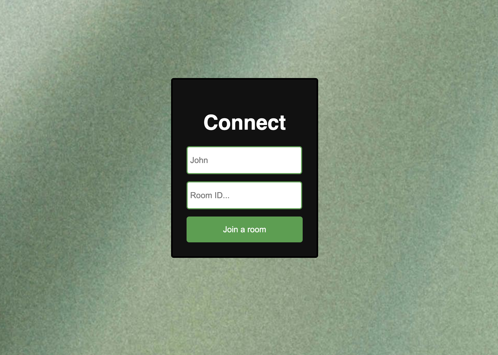
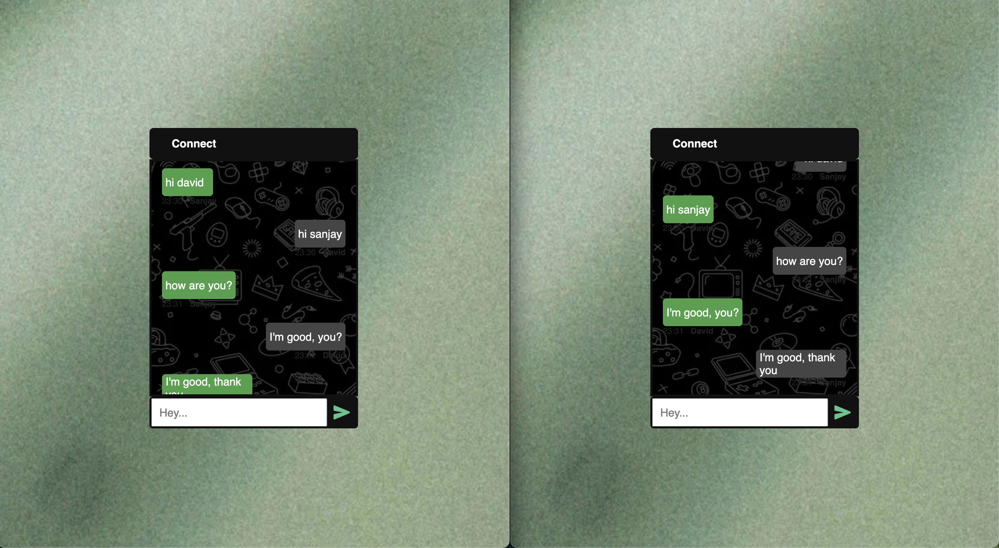

<h1>Connect</h1>

<h2>About the project</h2>

  
Connect is a Realtime Chat app build with React allows users to communicate with
each other instantly over the internet.

👉 Live Demo: <a href='https://connect-react-client.vercel.app/'>Live Demo</a>

<h3>Build with:</h3>

» React.js  
» Node.js  
» Express.js  
» Socket.io  

<h2>Screenshot</h2>
 

Join chat page

Chat room page

